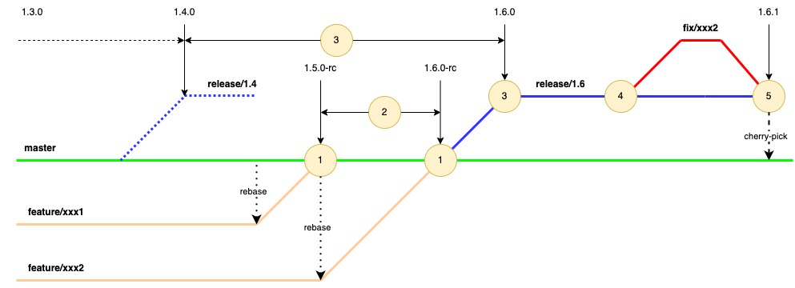
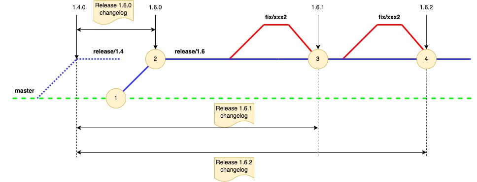

### Description

The script supports a pretty straight release branch-based process with a common picture you can get acquainted with below.
Tag version convention is based on Semantic Versioning 2.0.0

#### Tags and release patterns
Release candidate tag pattern - 1.x.0-rc
Release tag pattern - 1.X.x
Release branch pattern - release/1.X

#### Common schema

1. Developing is going in the feature/xxx1 branch and once user has decided developing is finished he creates MR with feature/xxx1 to the develop branch;
2. Right after MR is merged automation creates a release candidate tag 1.5.0-rc;
3. IF user decides to promote a release candidate tag 1.6.0-rc for example he should run an automation part which:
- cuts a new release branch release/1.6 from develop which is pinned to the release candidate tag
- creates a Gitlab Release 1.6.0 with release notes (see details below).
4. IF the release has a bug developer cuts the fix/xxx3 branch from release/1.6, prepares a fix, and merges his fix/xxx3  to release/1.6 branch back via MR.
5. Right after fix/-xxx3 is merged to release/1.6 automation generates a new release tag 1.6.1 with incremented patch version and also generates a new Gitlab Release 1.6.1

#### Release notes generation
All release notes will be stored in Gitlab Release. Gitlab Release is a kind of project snapshot which is being assigned to a specific tag (as one of the best practice examples).
More details you can find in Gitlab documentation - https://docs.gitlab.com/ee/user/project/releases/

1. Right after you have promoted release candidate 1.6.0-rc (1) automation creates a new release/1.6 branch (2), new release tag 1.6.0, and also generates Gitlab release based on the new release tag.
Release notes are being generated on diff between new and previous release tags.
Example - if your new release tag is 1.6.0, the diff will be calculated between 1.6.0 and 1.4.0 (2). If 1.6.0 is the first release tag in the project release notes will be empty (to be aware do not generate a big list of notes based on a big commit history).
2. The same for fix versions - once you merge your changes to release/1.6 (3) branch automation creates a new release tag 1.6.1 and also generates a new Gitlab release.
Release notes are being generated on diff between new and previous release fix tags (4).
Example - if your new release fix tag is 1.6.1, the diff will be calculated between 1.6.1 and 1.4.0 tags.

